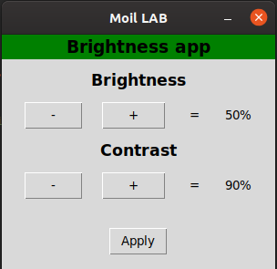

## Setting to use python to adjust brightness and contrast

---

**ddcutil** is a Linux program for managing monitor settings, such as brightness, color levels, and input source. Generally speaking, any settings that can be changed by pressing buttons on the monitor can be modified by **ddcutil**

**ddcutil** primarily uses DDC/CI (Display Data Channel Command Interface) to communicate with monitors implementing MCCS (Monitor Control Command Set) over I2C. Normally, the video driver for the monitor exposes the I2C channel as devices named /dev/i2c-n. Alternatively, there is support for monitors (such as Eizo ColorEdge displays) that implement MCCS using a USB connection.

To run This program just use command:

$ python3 main.py

## usage

The plus (+) and minus (-) buttons adjust monitor brightness, and contrast. Click apply for the new settings to take effect.

## Prerequisites

- Get ddcutil from https://github.com/rockowitz/ddcutil

  $ sudo apt install ddcutil

- The i2c-dev kernel module must be loaded:
  $ sudo modprobe i2c-dev

- make a folder .config in /root 
  
  $ cd /root
  
  $ sudo mkdir .config

